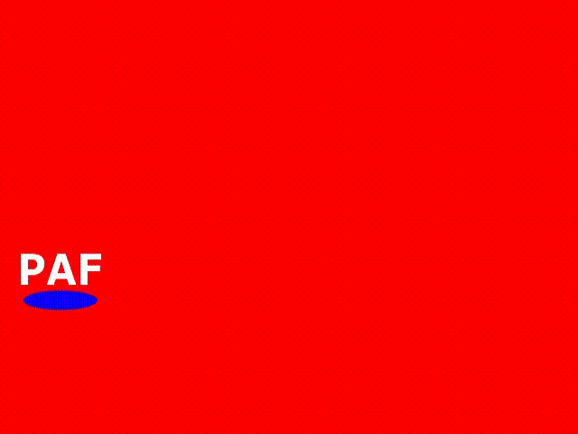

# PlayStation 2 Application Framework

     *******      **     ********
    /**////**    ****   /**///// 
    /**   /**   **//**  /**      
    /*******   **  //** /******* 
    /**////   **********/**////  
    /**      /**//////**/**      
    /**      /**     /**/**      
    //       //      // //    

## Introduction
The PAF (**PlayStation 2 Application Framework**) is a lightweight C++ framework designed to simplify the development of simple PS2 applications and 2D games. It provides straightforward access to the PlayStation 2's essential rendering and input capabilities, allowing developers to focus on application logic instead of low-level hardware details.

The framework currently includes:
* ScreenManager
* Screen
* Basic renderables
* Pad input
* Timer
* Debug console (work in progress)

## The Screen
Within this framework, you instantiate a `ScreenManager` in your `main()` function, switch to a subclass of the `Screen` class, and then call the manager's `main` method. To create a screen, subclass `Screen` and override its constructor to add your `Renderable` objects. You have direct access to the `Renderable* renderables` field, along with the convenience method `SetRenderableCount(int)`, which allocates memory for your renderables.

## The Renderables
A `Renderable` is any object that can be drawn on screen. The `Screen` class itself is a renderable, since it includes an internal `Render()` method that is invoked by the `ScreenManager`. You can create a custom renderable by subclassing `Renderable` and overriding the `Render(GSGLOBAL*)` method. The framework provides several basic renderables:
* Square (a simple colored square)
* FontM (ROM font)
* Texture (any texture)

You can instantiate `FontM` and `Texture` through the `ScreenManager`, while `Square` can be created directly.

## Installation
PAF installs its headers and libraries under `$(PS2SDK)/paf/include` and `$(PS2SDK)/paf/lib`, respectively.

To build and install from source—which is currently the only supported method—download the source code or clone this repository, then run:

    make install

from the project root.

## Samples

### DVD Screensaver
This sample displays a bouncing PAF text that moves across the screen and changes direction whenever it reaches a corner.

Located at `src/samples/dvdscreensaver`. 